### `aditya@github ~ $ ./contributions.sh`

<picture>
  <source media="(prefers-color-scheme: dark)" srcset="./heatmap-dark.svg">
  
</picture>

  

### `aditya@github ~ $ whoami`

<picture>
  <source media="(prefers-color-scheme: dark)" srcset="./card-dark.svg">
  
</picture>

 

<a href="https://github.com/adityasinghin01-hash">GitHub</a> &nbsp;·&nbsp;
<a href="https://x.com/aditya_s0z">X</a> &nbsp;·&nbsp;
<a href="https://www.linkedin.com/in/aditya-singh-aa365a386">LinkedIn</a>

<!--
  Everything above is generated. Do not hand-edit the SVGs.

    python3 scripts/fetch_contributions.py   # data/contributions.json
    python3 scripts/render_heatmap_svg.py    # heatmap-{dark,light}.svg
    python3 scripts/make_card_svg.py         # card-{dark,light}.svg

  Copy lives in scripts/profile.py, palette in scripts/theme.py.

  theme.py deliberately has no third-party imports. The scheduled workflow
  installs nothing and runs only the heatmap, so anything it imports must be
  stdlib — pulling shared constants out of the portrait module (which needs
  Pillow) failed every run with ModuleNotFoundError.

  The portrait source photo lives in assets/ and is gitignored on purpose.
  Regenerate the card locally and commit the SVG, never the photo.

  To preview an animation locally — static converters render these blank,
  because elements start hidden and only SMIL brings them in:

    ./scripts/preview.sh card-dark.svg /tmp/out.png 11000
-->
