<h3><code>aditya@github ~ $ ./contributions.sh</code></h3>

<picture>
  <source media="(prefers-color-scheme: dark)" srcset="./heatmap-dark.svg">
  
</picture>

  

<h3><code>aditya@github ~ $ whoami</code></h3>

<table>
<tr>
<td valign="top">
  <picture>
    <source media="(prefers-color-scheme: dark)" srcset="./ascii-dark.svg">
    
  </picture>
</td>
<td valign="top">
  <picture>
    <source media="(prefers-color-scheme: dark)" srcset="./info-dark.svg">
    
  </picture>
</td>
</tr>
</table>

 

<h3><code>aditya@github ~ $ cat links.txt</code></h3>

<a href="https://x.com/aditya_s0z">X</a> &nbsp;·&nbsp;
<a href="https://www.linkedin.com/in/aditya-singh-aa365a386">LinkedIn</a>

<!--
  Everything above is generated. Do not hand-edit the SVGs.

    python3 scripts/fetch_contributions.py   # data/contributions.json
    python3 scripts/render_heatmap_svg.py    # heatmap-{dark,light}.svg
    python3 scripts/make_ascii_svg.py        # ascii-{dark,light}.svg
    python3 scripts/make_info_card.py        # info-{dark,light}.svg

  The portrait generators read assets/source-portrait.png, which is
  gitignored on purpose — the source photos stay local and never ship.
  Regenerate the ASCII locally and commit the resulting SVG, not the photo.

  Copy lives in scripts/profile.py. The heatmap refreshes daily via
  .github/workflows/update-profile-art.yml; the portrait and card only
  change when you regenerate them.

  To preview an animation locally (static converters render these blank,
  because every element starts at opacity 0 and only SMIL brings it in):

    ./scripts/preview.sh ascii-dark.svg /tmp/out.png 4000
-->
